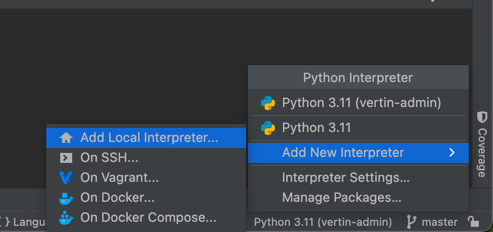

## 新手部署使用

1. 安装Nodejs环境(编译前端)
2. 安装pnpm包管理工具
3. 安装Python环境(运行后端)
4. 下载Pycharm 社区版本,使用Pycharm打开工程目录
5. 运行Python后端服务
6. 运行前端服务
7. 使用浏览器登录并查看项目

### 安装Nodejs环境(编译前端)
参考指南: [安装NodeJS](https://blog.csdn.net/Small_Yogurt/article/details/104968169)

### 安装pnpm包管理工具
参考指南: [安装pnpm](https://blog.csdn.net/m0_52827996/article/details/138163237)

### 安装Python3.x环境
参考指南 [安装Python](https://blog.csdn.net/m0_57081622/article/details/127180996)

### 安装Pycharm社区版本
参考指南 [安装pycharm社区版](https://blog.csdn.net/qq_40370687/article/details/128960168)

### 运行Python后端服务
打开pycharm，把工程目录拖进来

点击右下角的运行环境，添加一个解释器

然后点击下方的Terminal,输入 `pip3 install poetry`,等待安装完成
完成之后输入 `poetry install` 安装后端项目所有的依赖

最后运行 `poetry run python3 run.py`,这样后端服务就跑起来了。

### 运行前端服务
点击Terminal右边的`+` ,新开一个命令窗口
输入 `cd web`, 然后输入 `pnpm install` 按照前端依赖库
输入 `pnpm dev` 运行前端项目, 他会自动打开浏览器，并跳转到登录首页

### 使用浏览器登录并查看项目
登录页输入框中的用户名 密码就是默认值，输入后即可登入后台

